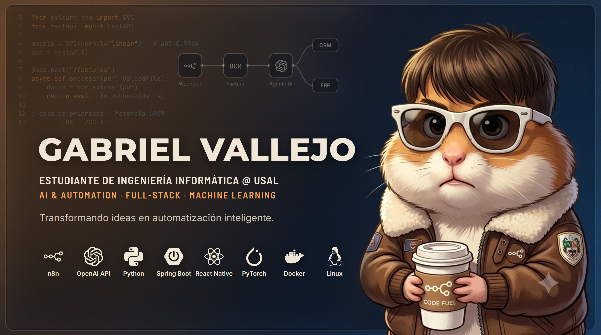

  

  

 

### ◆ Sobre mí

  <b>🎓 Estudiante de 2º de Ingeniería Informática en la Universidad de Salamanca (USAL)</b>  
  Me apasiona la intersección entre el desarrollo de software y la optimización de procesos: 
  he programado desde <b>ensamblador Motorola 6809 y Verilog</b> hasta <b>apps full-stack</b>, <b>Machine Learning</b> y <b>visión por computador</b>. 
  Mi enfoque actual es ayudar a empresas a escalar mediante <b>automatización inteligente</b>: 
  agentes de IA, OCR y flujos con n8n autoalojado sobre Docker.

  📍 Salamanca, España &nbsp;·&nbsp; 🔭 Construyendo agentes de IA para negocios &nbsp;·&nbsp; 🌱 Aprendiendo arquitectura de computadores y sistemas de BD 
  💬 Háblame de automatización, ML, bajo nivel o Linux &nbsp;·&nbsp; ⚡ Dato curioso: mi primera app recomienda perfume según el outfit

 

### ◆ Formación

| | Titulación | Centro / Fecha |
| :---: | :--- | :--- |
| 🎓 | **Grado en Ingeniería Informática** (2º curso) | Universidad de Salamanca · 2025 – actualidad |
| 🤖 | **Diploma en IA, Machine Learning y Redes Neuronales** | Abril 2026 |
| 🌍 | **Inglés B2** certificado | — |

 

### ◆ Conéctate conmigo

  
  
  
  

 

### ◆ Proyectos destacados

#### 👗 [Style & Scent Engine](https://github.com/Gabriel-Vallejo/style-scent-engine) &nbsp; `Java` `TypeScript` `Python`

> App que recomienda el perfume ideal de tu colección según el outfit del día.

- **Backend:** Java 21 + Spring Boot 4.1 + Spring Data JPA sobre MySQL 8 en Docker (esquema en 3FN, 198 reglas de sinergia color/estilo ↔ familia olfativa).
- **App móvil:** React Native + Expo en TypeScript, con APK nativo para Android vía EAS Build ([descargar](https://github.com/Gabriel-Vallejo/style-scent-engine/releases)).
- **Visión por IA:** microservicio FastAPI con OpenCV, k-means en espacio Lab + CIEDE2000 para el color dominante y clasificación *zero-shot* con CLIP (Hugging Face) para registrar prendas con una foto.
- **Calidad:** CI en GitHub Actions con 31 tests de backend, 17 de pytest y chequeos de TypeScript/ESLint en cada push.

#### 🩺 [Clasificador Oncológico ML](https://github.com/Gabriel-Vallejo/breast-cancer-ml-classifier) &nbsp; `Python`

> Pipeline de Machine Learning para clasificar tumores de mama (benigno / maligno) priorizando no dejar escapar falsos negativos.

- Dataset *Breast Cancer Wisconsin (Diagnostic)*: 30 rasgos morfométricos, estandarización Z-score y validación cruzada estratificada de 10 particiones.
- 6 modelos comparados: kNN, SVM lineal y RBF, árbol de decisión, regresión logística y perceptrón multicapa (MLP).
- **Mejor modelo — SVM lineal:** AUC **0.9964** · recall **0.98** (41 de 42 malignos) · accuracy **0.9825**.
- Stack: scikit-learn, NumPy, Pandas, Matplotlib, Seaborn y Joblib para exportar los modelos.

 

### ◆ Automatización para empresas

  <i>«La IA trabaja, tú creces»</i> — flujos con <b>n8n autoalojado</b> en VPS de alta disponibilidad 
  que ahorran <b>+10 h semanales</b> de tareas repetitivas.

| Servicio | Qué hace |
| :--- | :--- |
| 🤖 **Agentes de ventas con IA** | Clasifican leads y responden 24/7 por WhatsApp y email |
| 🧾 **Gestión de facturas** | Extraen datos de PDFs y facturas con OCR + IA y los pasan a contabilidad |
| 🔄 **Sincronización de datos** | Conectan Excel, CRMs y sistemas de facturación |
| 📊 **Cuadros de mando** | Control en tiempo real para servicios de mantenimiento |

 

### ◆ En el laboratorio

| 🚀 Proyecto | 🧰 Stack | 🛠️ Estado |
| :--- | :--- | :---: |
| [**Style & Scent Engine**](https://github.com/Gabriel-Vallejo/style-scent-engine) | Spring Boot · React Native · CLIP | `[Completado]` |
| [**Clasificador Oncológico ML**](https://github.com/Gabriel-Vallejo/breast-cancer-ml-classifier) | Python · scikit-learn | `[Completado]` |
| **Cola de prioridad en ensamblador** (USAL, programada y defendida) | Motorola 6809 | `[Completado]` |
| **Automatización de facturas** (OCR + IA) | n8n · OCR · LLM | `[Operativo]` |
| **Dashboard para servicios de mantenimiento** | n8n · Docker | `[Operativo]` |
| **Agentes de atención al cliente** (WhatsApp) | n8n · LLM · WhatsApp | `[Operativo]` |
| **Segundo cerebro de la carrera**: wiki en Obsidian con +170 apuntes, mantenida por un agente de IA | Obsidian · Claude Code · Python · Git | `[En marcha]` |

 

### ◆ Pila tecnológica

  <h4>— Lenguajes —</h4>
  
   
  
  
  

  <h4>— Backend y Móvil —</h4>
  
   
  
  
  

  <h4>— Machine Learning y Visión —</h4>
  
   
  
  
  
  

  <h4>— Automatización e IA aplicada —</h4>
  
  
  
  
  
  

  <h4>— Infraestructura y DevOps —</h4>
  
   
  
  
  
  

  <h4>— Herramientas —</h4>
  
   
  
  
  

  💻 <b>Setup:</b> Lenovo Legion (Intel Core i9 + RTX 5070) · arranque dual Windows 11 Pro + Pop!_OS con rEFInd y systemd-boot

 

### ◆ Escuchar

  

 

### ◆ Fuera del teclado

| | |
| :---: | :--- |
| 🏋️ | Fuerza e hipertrofia con dieta alta en proteína · récord de **400 kg en prensa** |
| 🎮 | +400 juegos en Steam: souls-like, survival horror y Final Fantasy · LoL (Top, OTP Sett) · FC 26 Clubes Pro · Pokémon GO |
| 📚 | Manga y manhwa: JoJo's Bizarre Adventure, Lookism, Doom Breaker |
| 🎧 | Reguetón y urbano: J Balvin y Bad Bunny |
| 🧴 | Colecciono perfumes de diseñador y de nicho (de ahí salió Style & Scent Engine) |
| 👟 | Streetwear: baggy, denim oscuro y Jordan 4 |
| ✈️ | 2026: Riga, Florencia, Roma y Venecia |

